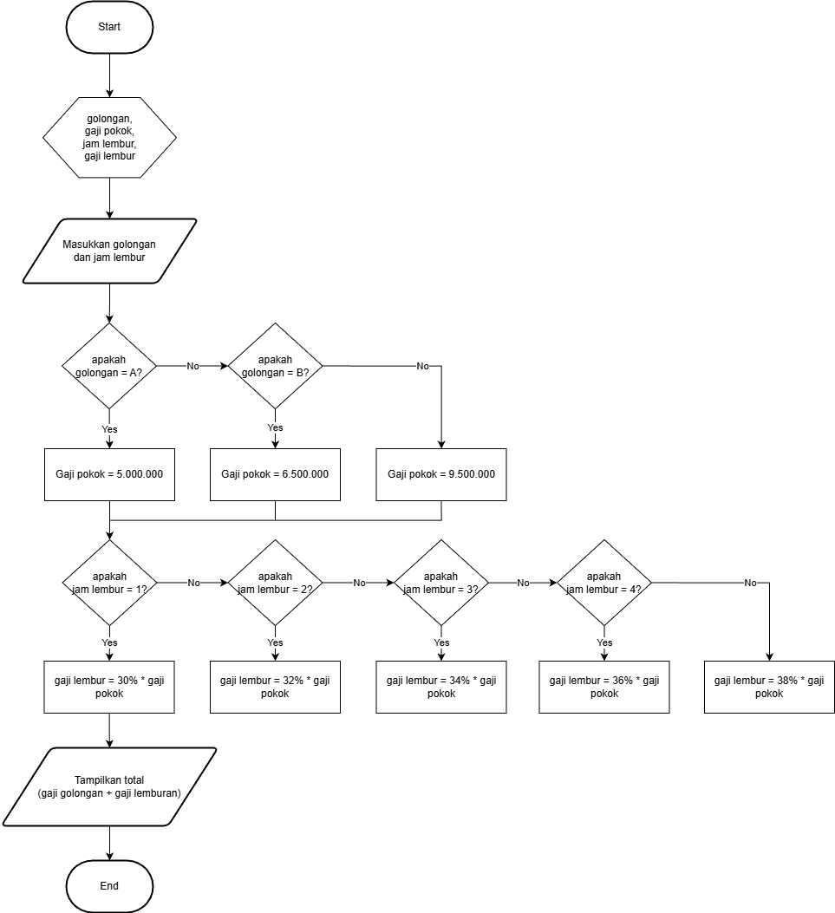

# Program Perhitungan Gaji Karyawan (Java)

Program ini dibuat untuk memenuhi **Tugas 2** sesuai instruksi dan flowchart yang diberikan dosen.  
Program menggunakan bahasa pemrograman **Java**, memanfaatkan **operator**, **statement IF**, dan menerima input berupa **Golongan Karyawan** serta **Jam Lembur**.

---

## 📘 Deskripsi Program

Perusahaan memiliki tiga golongan karyawan:

| Golongan | Gaji Pokok        |
|----------|--------------------|
| A        | Rp 5.000.000       |
| B        | Rp 6.500.000       |
| C        | Rp 9.500.000       |

Ketentuan pembayaran lembur:

| Jam Lembur | Persentase Lembur dari Gaji Pokok |
|------------|-----------------------------------|
| 1 Jam      | 30%                               |
| 2 Jam      | 32%                               |
| 3 Jam      | 34%                               |
| 4 Jam      | 36%                               |
| ≥ 5 Jam    | 38%                               |

Program akan:
1. Menerima input Golongan (A/B/C)
2. Menerima input jumlah jam lembur
3. Menghitung gaji pokok berdasarkan golongan
4. Menghitung gaji lembur berdasarkan jam lembur
5. Menampilkan total gaji: **gaji pokok + gaji lembur**

---

## 🧩 Flowchart
Flowchart program yang digunakan pada tugas ini adalah sebagai berikut:




---

## 💻 Kode Program

```java
import java.util.Scanner;

public class GajiKaryawan {
    public static void main(String[] args) {

        Scanner input = new Scanner(System.in);

        String golongan;
        int jamLembur;
        double gajiPokok = 0;
        double gajiLembur = 0;

        System.out.print("Masukkan Golongan (A/B/C): ");
        golongan = input.nextLine().toUpperCase();

        System.out.print("Masukkan Jam Lembur: ");
        jamLembur = input.nextInt();

        // Menentukan gaji pokok sesuai golongan
        if (golongan.equals("A")) {
            gajiPokok = 5000000;
        } else if (golongan.equals("B")) {
            gajiPokok = 6500000;
        } else {
            gajiPokok = 9500000; // Golongan C
        }

        // Menentukan gaji lembur sesuai flowchart
        if (jamLembur == 1) {
            gajiLembur = 0.30 * gajiPokok;
        } else if (jamLembur == 2) {
            gajiLembur = 0.32 * gajiPokok;
        } else if (jamLembur == 3) {
            gajiLembur = 0.34 * gajiPokok;
        } else if (jamLembur == 4) {
            gajiLembur = 0.36 * gajiPokok;
        } else if (jamLembur >= 5) {
            gajiLembur = 0.38 * gajiPokok;
        } else {
            gajiLembur = 0;
        }

        double totalGaji = gajiPokok + gajiLembur;

        System.out.println("\n==============================");
        System.out.println("Gaji Pokok   : Rp " + gajiPokok);
        System.out.println("Gaji Lembur  : Rp " + gajiLembur);
        System.out.println("TOTAL GAJI   : Rp " + totalGaji);
        System.out.println("==============================");
    }
}
